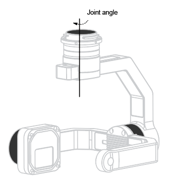
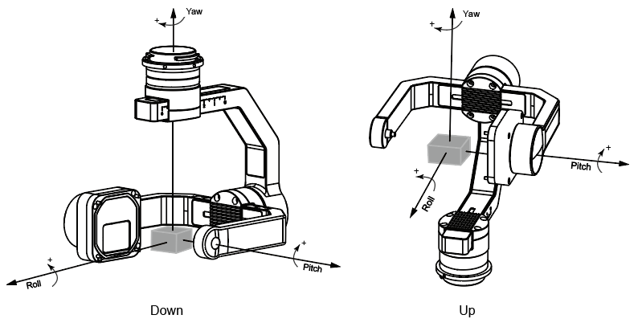
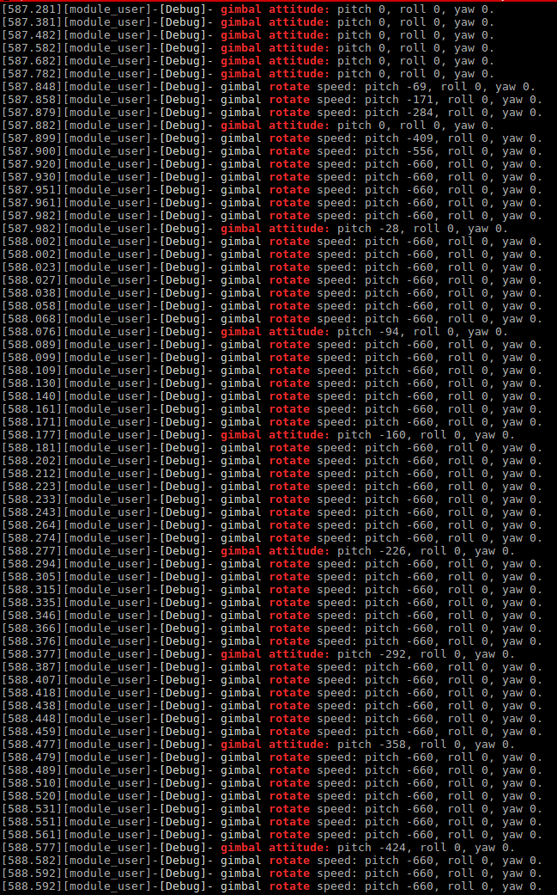
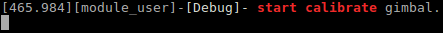
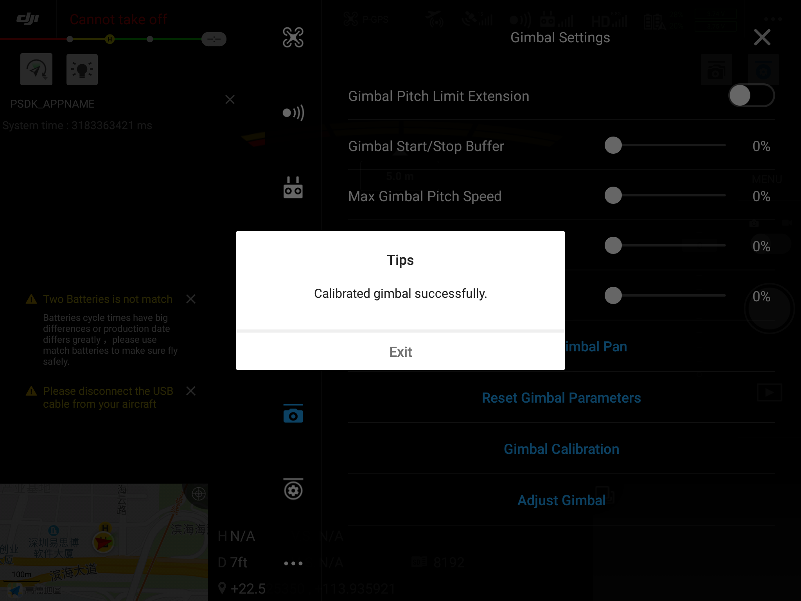

> **NOTE** 
> * This article is **Machine-Translated**. If you have any questions about this article, please send an <a href="mailto:dev@dji.com">E-mail </a>to DJI, we will correct it in time. DJI appreciates your support and attention.
> * The payload only developed by SkyPort support to use the gimbal control.

## Overview 
Using the "Gimbal Control" function of the PSDK, developers need to design the gimbal of the payload and develop the program to control the gimbal. After registering the gimbal control function to the interface specified by PSDK, the user can use the Mobile APP which developed by MSDK and controller could control the payload with gimbal function based on PSDK, and obtain relevant information such as attitude.


## The state of the gimbal
The payload developed based on PSDK needs to report the status of the gimbal, attitude, and calibration information, which is convenient for the user's Mobile APP or onboard computer control the payload precisely.

## Joint angle and attitude angle
#### Joint and joint angle  
Figure 1 shows the joints of the gimbal. The joint of the gimbal is the motor to drive the payload. This tutorial uses the body coordinate system to describe the joint angle of the gimbal.  
<div>
<div style="text-align: center"><p>Figure 1 Joint angle </p>
</div>
<div style="text-align: center"><p><span>
      </span></p>
</div></div>
  
#### Attitude and attitude angle
Figure 2 shows the attitude of the payload, according to the control command, the gimbal could spin the payload to a different position. This tutorial uses the geodetic coordinate system (NED, North East Coordinate System) to describe the attitude angle of the payload, this angle is also called Euler-Angle.

<div>
<div style="text-align: center"><p>Figure 2 Attitude angle </p>
</div>
<div style="text-align: center"><p><span>
      </span></p>
</div></div>
   

### Gimbal Mode
The gimbal mode determines how the gimbal rotates when following the drone:

* Free: When the attitude of the drone changes, the gimbal would not rotate.
* FPV: When the attitude of the drone changes, the gimbal would rotate the yaw and roll to ensure that the current field of view of the payload would not change.
* YAW following: In this mode, the yaw axis of the gimbal will follow the drone.

> **NOTE** In the above three modes, other modules (which in the drone), controller and Mobile APP could control the gimbal.

### Gimbal Control 
#### Control Method 
There are three control methods:
* Relative angle control: Users could control the gimbal which developed based on PSDK to rotate the specified angle within a specified time.
* Absolute angle control: According to the user's command, the gimbal which developed based on PSDK will rotate from the current position to the specified position within a specified time.
* Speed ​​control: Users could control the rotation speed of the gimbal which developed based on PSDK.

> **NOTE** 
> * Use the angle control mode, the rotation time of the gimbal is limited by the maximum rotation speed and acceleration of the gimbal. The actual rotation angle is limited by the limit angle of the gimbal.
> * Use the speed control mode, the gimbal rotates for 0.5s according to the speed specified by the user. When the gimbal rotates to the limit angle, it will stop.

#### Control Permissions
The details for the gimbal control permissions, please refer to Table 1.

* Rules
  * The control action with low priority could control the gimbal only after the control action with high priority ends.
  * High-priority control actions can preempt control rights of low-priority control actions;
  * Control scenes of equal priority are preempted in order of control start time, and control scenes with a later start control time cannot seize control rights.

* Release
  * The control module will release the control right after completing the control of the gimbal;
  * If the control module does not release the control right after completing the control of the gimbal, the gimbal which developed based on PSDK will automatically release the control right within the specified time after the end of the gimbal rotation. 

<div><div>
<p>
Table 1 The control permissions of the gimbal
  </p></div>
<div>
<table id="01">
  <thead>
    <tr>
      <th>Role</th>
      <th>level</th>
      <th>Duration</th>
      <th>Timeout</th>
    </tr>
  </thead>
  <tbody>
    <tr>
      <td>The gimbel rockers of the controller</td>
      <td>1</td>
      <td>0</td>
      <td>500 ms</td>
    </tr>
    <tr>
      <td>Commands of the MSDK</td>
      <td>1</td>
      <td>Specified by control commands</td>
      <td>2000 ms</td>
    </tr>
    <tr>
      <td>DJI APP gimbal control commands</td>
      <td>2</td>
      <td>0</td>
      <td>500 ms</td>
    </tr>
    <tr>
      <td>Payload coordination command</td>
      <td>2</td>
      <td colspan="2" style="text-align: center">Specified by control command</td>
    </tr>
    <tr>
      <td>The gimbal speed ​​command of MSDK</td>
      <td>2</td>
      <td>0</td>
      <td>500 ms</td>
    </tr>
    <tr>
      <td>The gimbal control commands of the mission</td>
      <td>2</td>
      <td colspan="2" style="text-align: center">Specified by control command</td>
    </tr>
  </tbody>
</table></div></div>

#### Smoothness
The smoothness of the gimbal refers to the urgency of the gimbal's response. The gimbal developed using the PSDK supports users to set the smooth control coefficients through DJI Pilot and Mobile APPs based on MSDK to realize the smooth start and stop of the gimbal.

* Smooth control coefficient: The smooth control coefficient determines the maximum acceleration of the gimbal rotation.
* Maximum acceleration of gimbal rotation = 10000 × (0.8 ^ (1 + X)) deg / s ^ 2 (X is the smoothing control coefficient)

#### Maximum speed percentage
* Maximum speed percentage: The maximum speed percentage determines the maximum speed at which the gimbal rotates.
* The actual maximum rotation speed of the gimbal = default maximum speed × maximum speed percentage
  
  > **NOTE**  Users can set the default maximum gimbal rotation speed according to the needs.

#### Angle adjustment 

The gimbal which developed based on the PSDK, supports users use DJI Pilot and Mobile APP which based on MSDK to adjust the angle of the joint angle finely. The adjustment results can also be stored in the payload as calibration parameters to reduce the Various errors.

#### Limited
To prevent the gimbal from being damaged or interfered with the drone's flight mission due to structural interference during the working, you must set the mechanical and software limit.

* Mechanical: The mechanical limit is determined by the physical body, for details please refer to [Payload Criterion](../payloadguide/payload-criterion.html).
* Software: 
  * Set the Euler angle limit of the gimbal's pitch、roll and yaw axis;
  * Set the Euler angle extension angle limit of the pitch;
  * Set the gimbal joint angle limit.

  > **TIPS** 
  > * After using the tilt range extension function, you can set the Euler angle limit of the gimbal's pitch axis to the default limit or the extended limit.
  > * When the joint angle of the gimbal reaches the limit, the DJI Pilot and the Mobile APP developed based on MSDK will receive the prompt message that the gimbal is rotated to the limit angle.

#### Reset
The payload developed based on the PSDK supports user uses DJI Pilot and Mobile APP based on MSDK to reset the gimbal and reset the gimbal's attitude to the initial state.

* Yaw: Reset angle of yaw axis to the sum of yaw axis angle of aircraft and the fine-tune angle of yaw axis of gimbal. 
* Yaw and pitch axis of gimbal: Reset angle of yaw axis to the sum of yaw axis angle of aircraft and the fine-tune angle of yaw axis of gimbal, and reset pitch axis angle to the fine-tune angle. 
* Yaw axis and pitch: reset the yaw axis to the sum of the drone yaw axis and the gimbal fine-tuning angle. Reset the pitch axis to the sum of -90° and the fine-tuning angle of the gimbal (under), and the sum of the 90° and the fine-tuning angle of the gimbal (upper).
* Reset the yaw axis to the sum of -90° and the fine-tuning angle of the gimbal (under), the sum of the 90° and the fine-tuning angle of the gimbal (upper).   

## Develop gimbal control function
According to the development platform and the requirements, developers need to develop the gimbal control function by themselves refer to the function struct `T_PsdkGimbalCommonHandler`, after register the functions to the interface in the PSDK, User use DJI Pilot or Mobile APP developed based on MSDK could control the payload, which has a gimbal.

```c
    // Obtain the information of the gimbal.
    s_commonHandler.GetSystemState = GetSystemState;
    s_commonHandler.GetAttitudeInformation = GetAttitudeInformation;
    s_commonHandler.GetCalibrationState = GetCalibrationState;
    s_commonHandler.GetRotationSpeed = GetRotationSpeed;
    s_commonHandler.GetJointAngle = GetJointAngle;
    // Developed the functions to control the gimbal.
    s_commonHandler.Rotate = PsdkTest_GimbalRotate;
    s_commonHandler.StartCalibrate = StartCalibrate;
    s_commonHandler.SetControllerSmoothFactor = SetControllerSmoothFactor;
    s_commonHandler.SetPitchRangeExtensionEnabled = SetPitchRangeExtensionEnabled;
    s_commonHandler.SetControllerMaxSpeedPercentage = SetControllerMaxSpeedPercentage;
    s_commonHandler.RestoreFactorySettings = RestoreFactorySettings;
    s_commonHandler.SetMode = SetMode;
    s_commonHandler.Reset = Reset;
    s_commonHandler.FineTuneAngle = FineTuneAngle;
```

## Develop with the Gimbal Control 
Using the gimbal control function, developer needs to develop gimbal control function, then is the gimbal limit function, adjust the gimbal's attitude, target angle, and limit mark according to the gimbal mode, and finally develop the gimbal calibration function.

### Develop the basic function 

> **NOTE** 
please use SkyPort V2 or SkyPort to develop the gimbal of the payload. If your Hardware Platform is X-Port, please refer to [X-Port Control](./X-Port.html).

#### 1. Initialization
Before using the "Gimbal Control" to develop the payload, the developer needs to initialize the module of the gimbal control with the following code.

```c
psdkStat = PsdkGimbal_Init();
if (psdkStat != PSDK_RETURN_CODE_OK) {
    PsdkLogger_UserLogError("init gimbal module error: %lld", psdkStat);
}
```

#### 2. Register the gimbal control function
Use the gimbal control function of the PSDK, the developer must register the functions of the gimbal to the specified interface.

```c
psdkStat = PsdkGimbal_RegCommonHandler(&s_commonHandler);
if (psdkStat != PSDK_RETURN_CODE_OK) {
    PsdkLogger_UserLogError("gimbal register common handler error: %lld", psdkStat);
}
```

#### 3. Obtain the status of the gimbal
call the interface `GetSystemStaobtain` to obtain the status of the gimbal.  

```c
static T_PsdkReturnCode GetSystemState(T_PsdkGimbalSystemState *systemState)
{
    PsdkLogger_UserLogDebug("get gimbal system state");
    *systemState = s_systemState;
    return PSDK_RETURN_CODE_OK;
}
```

#### 4. Register the function to calculate the rotation speed     
Construct the callback function to calculate the rotation speed of the gimbal, adjust the attitude of the gimbal, and record the target angle and rotation speed of the gimbal rotation.      

```c
T_PsdkReturnCode PsdkTest_GimbalRotate(E_PsdkGimbalRotationMode rotationMode,
                                       T_PsdkGimbalRotationProperty rotationProperty,
                                       T_PsdkAttitude3d rotationValue)
{
    T_PsdkReturnCode psdkStat;
    T_PsdkReturnCode returnCode = PSDK_RETURN_CODE_OK;
    T_PsdkAttitude3d targetAttitudeDTemp = {0};
    T_PsdkAttitude3f targetAttitudeFTemp = {0};
    T_PsdkAttitude3d speedTemp = {0};

    PsdkLogger_UserLogDebug("gimbal rotation value invalid flag: pitch %d, roll %d, yaw %d.",
                            rotationProperty.rotationValueInvalidFlag.pitch,
                            rotationProperty.rotationValueInvalidFlag.roll,
                            rotationProperty.rotationValueInvalidFlag.yaw);

    if (PsdkOsal_MutexLock(s_attitudeMutex) != PSDK_RETURN_CODE_OK) {
        PsdkLogger_UserLogError("mutex lock error");
        return PSDK_RETURN_CODE_ERR_UNKNOWN;
    }

    if (PsdkOsal_MutexLock(s_commonMutex) != PSDK_RETURN_CODE_OK) {
        PsdkLogger_UserLogError("mutex lock error");
        returnCode = PSDK_RETURN_CODE_ERR_UNKNOWN;
        goto out2;
    }

    switch (rotationMode) {
        case PSDK_GIMBAL_ROTATION_MODE_RELATIVE_ANGLE:
            PsdkLogger_UserLogDebug("gimbal relative rotate angle: pitch %d, roll %d, yaw %d.", rotationValue.pitch,
                                    rotationValue.roll, rotationValue.yaw);
            PsdkLogger_UserLogDebug("gimbal relative rotate action time: %d.",
                                    rotationProperty.relativeAngleRotation.actionTime);

            if (s_rotatingFlag == true) {
                PsdkLogger_UserLogWarn("gimbal is rotating.");
                goto out1;
            }

            targetAttitudeDTemp.pitch =
                rotationProperty.rotationValueInvalidFlag.pitch == true ? s_attitudeInformation.attitude.pitch : (
                    s_attitudeInformation.attitude.pitch + rotationValue.pitch);
            targetAttitudeDTemp.roll =
                rotationProperty.rotationValueInvalidFlag.roll == true ? s_attitudeInformation.attitude.roll : (
                    s_attitudeInformation.attitude.roll + rotationValue.roll);
            targetAttitudeDTemp.yaw =
                rotationProperty.rotationValueInvalidFlag.yaw == true ? s_attitudeInformation.attitude.yaw : (
                    s_attitudeInformation.attitude.yaw + rotationValue.yaw);

            targetAttitudeFTemp.pitch = targetAttitudeDTemp.pitch;
            targetAttitudeFTemp.roll = targetAttitudeDTemp.roll;
            targetAttitudeFTemp.yaw = targetAttitudeDTemp.yaw;
            PsdkTest_GimbalAngleLegalization(&targetAttitudeFTemp, s_aircraftAttitude, NULL);
            targetAttitudeDTemp.pitch = targetAttitudeFTemp.pitch;
            targetAttitudeDTemp.roll = targetAttitudeFTemp.roll;
            targetAttitudeDTemp.yaw = targetAttitudeFTemp.yaw;

            s_targetAttitude = targetAttitudeDTemp;
            s_rotatingFlag = true;
            s_controlType = TEST_GIMBAL_CONTROL_TYPE_ANGLE;

            psdkStat = PsdkTest_GimbalCalculateSpeed(s_attitudeInformation.attitude, s_targetAttitude,
                                                     rotationProperty.relativeAngleRotation.actionTime, &s_speed);
            if (psdkStat != PSDK_RETURN_CODE_OK) {
                PsdkLogger_UserLogError("calculate gimbal rotation speed error: %lld.", psdkStat);
                returnCode = psdkStat;
                goto out1;
            }

            break;
        case PSDK_GIMBAL_ROTATION_MODE_ABSOLUTE_ANGLE:
            PsdkLogger_UserLogDebug("gimbal absolute rotate angle: pitch %d, roll %d, yaw %d.", rotationValue.pitch,
                                    rotationValue.roll, rotationValue.yaw);
            PsdkLogger_UserLogDebug("gimbal absolute rotate action time: %d.",
                                    rotationProperty.absoluteAngleRotation.actionTime);

            if (s_rotatingFlag == true) {
                PsdkLogger_UserLogWarn("gimbal is rotating.");
                goto out1;
            }

            targetAttitudeDTemp.pitch =
                rotationProperty.rotationValueInvalidFlag.pitch == true ? s_attitudeInformation.attitude.pitch
                                                                        : rotationValue.pitch;
            targetAttitudeDTemp.roll =
                rotationProperty.rotationValueInvalidFlag.roll == true ? s_attitudeInformation.attitude.roll
                                                                       : rotationValue.roll;
            targetAttitudeDTemp.yaw =
                rotationProperty.rotationValueInvalidFlag.yaw == true ? s_attitudeInformation.attitude.yaw
                                                                      : rotationValue.yaw;

            targetAttitudeFTemp.pitch = targetAttitudeDTemp.pitch;
            targetAttitudeFTemp.roll = targetAttitudeDTemp.roll;
            targetAttitudeFTemp.yaw = targetAttitudeDTemp.yaw;
            PsdkTest_GimbalAngleLegalization(&targetAttitudeFTemp, s_aircraftAttitude, NULL);
            targetAttitudeDTemp.pitch = targetAttitudeFTemp.pitch;
            targetAttitudeDTemp.roll = targetAttitudeFTemp.roll;
            targetAttitudeDTemp.yaw = targetAttitudeFTemp.yaw;

            s_targetAttitude = targetAttitudeDTemp;
            s_rotatingFlag = true;
            s_controlType = TEST_GIMBAL_CONTROL_TYPE_ANGLE;

            psdkStat = PsdkTest_GimbalCalculateSpeed(s_attitudeInformation.attitude, s_targetAttitude,
                                                     rotationProperty.absoluteAngleRotation.actionTime, &s_speed);
            if (psdkStat != PSDK_RETURN_CODE_OK) {
                PsdkLogger_UserLogError("calculate gimbal rotation speed error: %lld.", psdkStat);
                returnCode = psdkStat;
                goto out1;
            }

            break;
        case PSDK_GIMBAL_ROTATION_MODE_SPEED:
            PsdkLogger_UserLogDebug("gimbal rotate speed: pitch %d, roll %d, yaw %d.", rotationValue.pitch,
                                    rotationValue.roll, rotationValue.yaw);

            if (s_rotatingFlag == true && s_controlType == TEST_GIMBAL_CONTROL_TYPE_ANGLE) {
                PsdkLogger_UserLogWarn("gimbal is rotating.");
                goto out1;
            }

            memcpy(&speedTemp, &rotationValue, sizeof(T_PsdkAttitude3d));
            PsdkTest_GimbalSpeedLegalization(&speedTemp);
            s_speed = speedTemp;

            if (rotationValue.pitch != 0 || rotationValue.roll != 0 || rotationValue.yaw != 0) {
                s_rotatingFlag = true;
                s_controlType = TEST_GIMBAL_CONTROL_TYPE_SPEED;
            } else {
                s_rotatingFlag = false;
            }

            break;
        default:
            PsdkLogger_UserLogError("gimbal rotation mode invalid: %d.", rotationMode);
            returnCode = PSDK_RETURN_CODE_ERR_UNSUPPORT;
            goto out1;
    }

out1:
    if (PsdkOsal_MutexUnlock(s_commonMutex) != PSDK_RETURN_CODE_OK) {
        PsdkLogger_UserLogError("mutex unlock error");
        returnCode = PSDK_RETURN_CODE_ERR_UNKNOWN;
        goto out2;
    }

out2:
    if (PsdkOsal_MutexUnlock(s_attitudeMutex) != PSDK_RETURN_CODE_OK) {
        PsdkLogger_UserLogError("mutex unlock error");
        return PSDK_RETURN_CODE_ERR_UNKNOWN;
    }

    return returnCode;
}
```

#### 5. Gimbal rotation control   
Figure 3 shows that the payload uses the speed control to control the rotation of the gimbal, the speed is converted by three amounts, the relative angle、absolute angle or the speed of the gimbal according to the attitude and rotation speed.

```c
nextAttitude.pitch =
    (float) s_attitudeHighPrecision.pitch + (float) s_speed.pitch / (float) PAYLOAD_GIMBAL_TASK_FREQ;
nextAttitude.roll =
    (float) s_attitudeHighPrecision.roll + (float) s_speed.roll / (float) PAYLOAD_GIMBAL_TASK_FREQ;
nextAttitude.yaw = (float) s_attitudeHighPrecision.yaw + (float) s_speed.yaw / (float) PAYLOAD_GIMBAL_TASK_FREQ;

if (s_controlType == TEST_GIMBAL_CONTROL_TYPE_ANGLE) {
    nextAttitude.pitch =
        (nextAttitude.pitch - s_targetAttitude.pitch) * s_speed.pitch >= 0 ? s_targetAttitude.pitch
                                                                           : nextAttitude.pitch;
    nextAttitude.roll = (nextAttitude.roll - s_targetAttitude.roll) * s_speed.roll >= 0 ? s_targetAttitude.roll
                                                                                        : nextAttitude.roll;
    nextAttitude.yaw =
        (nextAttitude.yaw - s_targetAttitude.yaw) * s_speed.yaw >= 0 ? s_targetAttitude.yaw : nextAttitude.yaw;
}

PsdkTest_GimbalAngleLegalization(&nextAttitude, s_aircraftAttitude, &s_attitudeInformation.reachLimitFlag);
s_attitudeInformation.attitude.pitch = nextAttitude.pitch;
s_attitudeInformation.attitude.roll = nextAttitude.roll;
s_attitudeInformation.attitude.yaw = nextAttitude.yaw;

s_attitudeHighPrecision.pitch = nextAttitude.pitch;
s_attitudeHighPrecision.roll = nextAttitude.roll;
s_attitudeHighPrecision.yaw = nextAttitude.yaw;

if (s_controlType == TEST_GIMBAL_CONTROL_TYPE_ANGLE) {
    if (memcmp(&s_attitudeInformation.attitude, &s_targetAttitude, sizeof(T_PsdkAttitude3d)) == 0) {
        s_rotatingFlag = false;
    }
} else if (s_controlType == TEST_GIMBAL_CONTROL_TYPE_SPEED) {
    if ((s_attitudeInformation.reachLimitFlag.pitch == true || s_speed.pitch == 0) &&
        (s_attitudeInformation.reachLimitFlag.roll == true || s_speed.roll == 0) &&
        (s_attitudeInformation.reachLimitFlag.yaw == true || s_speed.yaw == 0)) {
        s_rotatingFlag = false;
    }
}
```

<div>
<div style="text-align: center"><p> Figure 3 Gimbal control  </p>
</div>
<div style="text-align: center"><p><span>
      </span></p>
</div></div>

### Adjust parameters in different modes
The user could adjust the attitude、target angle and position limit in the different mode of the gimbal: 

* FPV:
    * Adjust the attitude of the gimbal: superimpose the amount of change in the attitude of the drone on the roll axis and heading axis of the gimbal;
    * Adjust the target angle of the gimbal rotation: When the gimbal rotates, the attitude change of the UAV is superimposed on the roll axis and heading axis of the gimbal.
* YAW:
    * Adjust the attitude of the gimbal: superimpose the amount of change in the attitude of the drone on the heading axis of the gimbal;
    * Adjust the target angle of the gimbal rotation: When the gimbal rotates, the attitude change of the UAV is superimposed on the heading axis of the gimbal.
* According to the attitude and the rotation range of the target angle, the payload would calculate the limit of the gimbal. 

```c
switch (s_systemState.gimbalMode) {
    case PSDK_GIMBAL_MODE_FREE:
        break;
    case PSDK_GIMBAL_MODE_FPV:
        s_attitudeInformation.attitude.roll += (s_aircraftAttitude.roll - s_lastAircraftAttitude.roll);
        s_attitudeInformation.attitude.yaw += (s_aircraftAttitude.yaw - s_lastAircraftAttitude.yaw);

        s_attitudeHighPrecision.roll += (float) (s_aircraftAttitude.roll - s_lastAircraftAttitude.roll);
        s_attitudeHighPrecision.yaw += (float) (s_aircraftAttitude.yaw - s_lastAircraftAttitude.yaw);

        if (s_rotatingFlag == true && s_controlType == TEST_GIMBAL_CONTROL_TYPE_ANGLE) {
            s_targetAttitude.roll += (s_aircraftAttitude.roll - s_lastAircraftAttitude.roll);
            s_targetAttitude.yaw += (s_aircraftAttitude.yaw - s_lastAircraftAttitude.yaw);
        }
        break;
    case PSDK_GIMBAL_MODE_YAW_FOLLOW:
        s_attitudeInformation.attitude.yaw += (s_aircraftAttitude.yaw - s_lastAircraftAttitude.yaw);

        s_attitudeHighPrecision.yaw += (float) (s_aircraftAttitude.yaw - s_lastAircraftAttitude.yaw);

        if (s_rotatingFlag == true && s_controlType == TEST_GIMBAL_CONTROL_TYPE_ANGLE) {
            s_targetAttitude.yaw += (s_aircraftAttitude.yaw - s_lastAircraftAttitude.yaw);
        }
        break;
    default:
        PsdkLogger_UserLogError("gimbal mode invalid: %d.", s_systemState.gimbalMode);
}
s_lastAircraftAttitude = s_aircraftAttitude;

attitudeFTemp.pitch = s_attitudeInformation.attitude.pitch;
attitudeFTemp.roll = s_attitudeInformation.attitude.roll;
attitudeFTemp.yaw = s_attitudeInformation.attitude.yaw;
PsdkTest_GimbalAngleLegalization(&attitudeFTemp, s_aircraftAttitude, &s_attitudeInformation.reachLimitFlag);
s_attitudeInformation.attitude.pitch = attitudeFTemp.pitch;
s_attitudeInformation.attitude.roll = attitudeFTemp.roll;
s_attitudeInformation.attitude.yaw = attitudeFTemp.yaw;

PsdkTest_GimbalAngleLegalization(&s_attitudeHighPrecision, s_aircraftAttitude, NULL);

attitudeFTemp.pitch = s_targetAttitude.pitch;
attitudeFTemp.roll = s_targetAttitude.roll;
attitudeFTemp.yaw = s_targetAttitude.yaw;
PsdkTest_GimbalAngleLegalization(&attitudeFTemp, s_aircraftAttitude, NULL);
s_targetAttitude.pitch = attitudeFTemp.pitch;
s_targetAttitude.roll = attitudeFTemp.roll;
s_targetAttitude.yaw = attitudeFTemp.yaw;
```

### Gimbal Calibration
It is recommended for the developer to develop the gimbal calibration function to help the user control the payload precisely.

#### 1.Develope the gimbal calibration function
Please implement the gimbal calibration function at first, register the gimbal calibration function to the specified interfaces, user could use the DJI Pilot or Mobile APP developed based on MSDK to calibrate the gimbal.

```c
static T_PsdkReturnCode StartCalibrate(void)
{
    T_PsdkReturnCode psdkStat;

    PsdkLogger_UserLogDebug("start calibrate gimbal.");

    psdkStat = PsdkOsal_GetTimeMs(&s_calibrationStartTime);
    if (psdkStat != PSDK_RETURN_CODE_OK) {
        PsdkLogger_UserLogError("get start time error: %lld.", psdkStat);
    }

    if (PsdkOsal_MutexLock(s_calibrationMutex) != PSDK_RETURN_CODE_OK) {
        PsdkLogger_UserLogError("mutex lock error");
        return PSDK_RETURN_CODE_ERR_UNKNOWN;
    }

    s_calibrationState.calibratingFlag = true;
    s_calibrationState.progress = 0;
    s_calibrationState.stage = PSDK_GIMBAL_CALIBRATION_STAGE_PROCRESSING;

    if (PsdkOsal_MutexUnlock(s_calibrationMutex) != PSDK_RETURN_CODE_OK) {
        PsdkLogger_UserLogError("mutex unlock error");
        return PSDK_RETURN_CODE_ERR_UNKNOWN;
    }

    return PSDK_RETURN_CODE_OK;
}
```
#### 2. Update the calibration status
After calibrating the gimbal the payload will record the calibration status of the gimbal, also the Mobile APP, which developed based on MSDK could obtain relate information.

```c
 // calibration
        if (s_calibrationState.calibratingFlag != true)
            goto unlockCalibrationMutex;

        progressTemp = (currentTime - s_calibrationStartTime) * 100 / PAYLOAD_GIMBAL_CALIBRATION_TIME_MS;
        if (progressTemp >= 100) {
            s_calibrationState.calibratingFlag = false;
            s_calibrationState.currentCalibrationProgress = 100;
            s_calibrationState.currentCalibrationStage = PSDK_GIMBAL_CALIBRATION_STAGE_COMPLETE;
        }

unlockCalibrationMutex:
        if (PsdkOsal_MutexUnlock(s_calibrationMutex) != PSDK_RETURN_CODE_OK) {
            PsdkLogger_UserLogError("mutex unlock error");
            continue;
        }
```

Figure 4 and Figure 5 are show that the DJI Pilot and the Mobile APP developed based on MSDK send the calibration command to the payload.  
<div>
<div style="text-align: center"><p>Figure 4 Gimbal calibration（1） </p>
</div>
<div style="text-align: center"><p><span>
      </span></p>
</div></div>

<div>
<div style="text-align: center"><p>Figure 5 Gimbal calibration（2） </p>
</div>
<div style="text-align: center"><p><span>
      </span></p>
</div></div>
