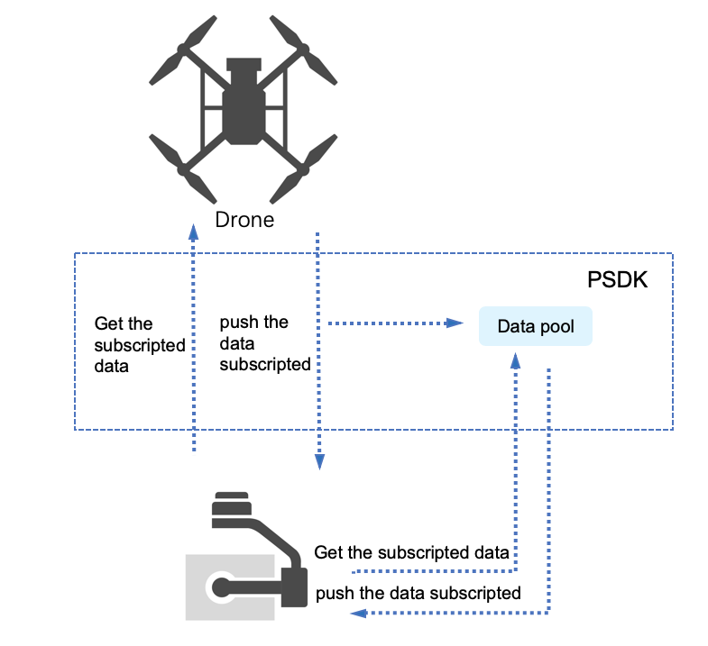
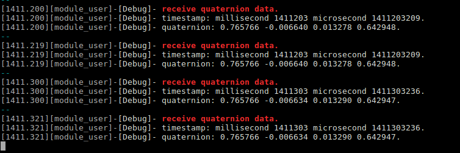
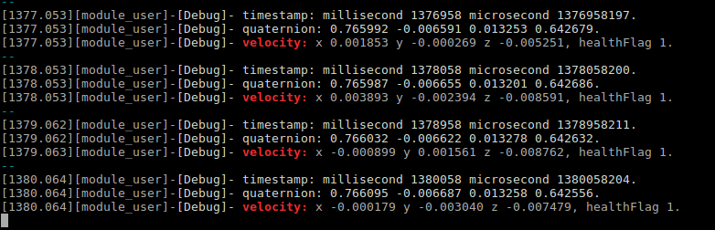

> **NOTE:** This article is **Machine-Translated**. If you have any questions about this article, please send an <a href="mailto:dev@dji.com">E-mail </a>to DJI, we will correct it in time. DJI appreciates your support and attention.

## Overview
Information management includes information acquisition and message subscription. The payload developed based on PSDK have information acquisition function, and could obtain information such as drone's model、mounted position, and some information about the Mobile APP. The message subscription could record data that subscribed by user, it is convenient for the user to use this function.   

## Concepts
### Information Acquisition  
Information acquisition is the function that the payload could acquire and record information such as the drone model, Hardware Platform type, and payload position.

>**NOTE:** Install the payload developed based on the PSDK on the drone, after 5s of initialization, the payload could obtain the information.

After initializing a payload developed based on PSDK, the information that the payload could obtain is as follows：

* Basic information: drone model, Hardware Platform type and payload position
* Mobile APP information: language and the screen type of the APP


### Information Subscription
 According to the status of the drone, each component of the drone will generate a large amount of real-time information and push that information to other modules.

#### Workflow
After setting the topics, the payload and the Mobile APP which developed based on MSDK could get the information,it shows as Figure 1.
<div>
<div style="text-align: center"><p>Figure 1 Subscription Workflow  </p>
</div>
<div style="text-align: center"><p><span>
      </span></p>
</div></div>

#### Subscription Topics
Table 1 shows the topic, which the user could subscribe in the drone.


<div><div><p>Table 1 Subscription Topics  </p></div>
<div>
<table>
  <thead>
      <th>Type</th>
      <th>Topic</th>
      <th>Frequency(Hz)</th>
  </thead>
  <tbody>
  <tr>
      <th rowspan="7">Basic Information</th>
      <td>Attitude Quaternion</td>
      <td>200</td>
    </tr>
    <tr>
      <td>Flight Speed</td>
      <td>200</td>
    </tr>
    <tr>
      <td>Fusion Altitude	</td>
      <td>200</td>
    </tr>
    <tr>
      <td>Relative Height	</td>
      <td>200</td>
    </tr>
    <tr>
      <td>Fusion Position	</td>
      <td>200</td>
    </tr>
    <tr>
      <td>Flight Status	</td>
      <td>50</td>
    </tr>
    <tr>
      <td>Battery</td>
      <td>50</td>
    </tr>
    <tr>
    <th rowspan="6">GPS</th>
    <td>GPS Data</td>
    <td>5</td>
    </tr>
    <tr>
      <td>GPS Time</td>
      <td>5</td>
    </tr>
    <tr>
      <td>GPS Position</td>
      <td>5</td>
    </tr>
    <tr>
      <td>GPS Speed</td>
      <td>5</td>
    </tr>
    <tr>
      <td>GPS Information</td>
      <td>5</td>
    </tr>
    <tr>
      <td>GPS Signal Level</td>
      <td>50</td>
    </tr>
    <tr>
     <th rowspan="5">RTK</th>
      <td>RTK Position</td>
      <td>5</td>
    </tr>
    <tr>
      <td>RTK Speed</td>
      <td>5</td>
    </tr>
    <tr>
      <td>RTK Yaw</td>
      <td>5</td>
    </tr>
    <tr>
      <td>RTK Position Properties</td>
      <td>5</td>
    </tr>
    <tr>
      <td>RTK Yaw Properties</td>
      <td>5</td>
    </tr>
  </tbody>
</table></div></div>


#### Rules
* The subscription function supports subscripted **5 types of frequencies**, such as 1Hz, 10Hz, 20Hz, 50Hz, 100Hz, each subscription can be subscribed only once.
* The subscription frequency of any parameter cannot be less than or equal to 0, and the total data length of topics with the same subscription frequency must be less than or equal to 242.

>**NOTE:** To simulate the payload in the DJI Assistant 2 couldn't obtain the GPS information and RTK information, but developers could subscribe the fusion data such as fusion location, fusion altitude, and relative altitude.

## Develop with the Information Subscription 
Here have two methods to subscribe the information:

* Callback, use interface `PsdkDataSubscription_RegTopicSync` to obtain the content and the time of the topic.
* Thread, use interface `PsdkDataSubscription_GetValueOfTopicWithTimestamp()` to get the content and the time of the topic.

>**NOTE:** The time of the subscription topic is temporarily unavailable.

#### Initialization
Before using the "Information Subscription" to develop the payload, developer needs to initialize the module of the information subscription with the following code.

```c
psdkStat = PsdkDataSubscription_Init();
if (psdkStat != PSDK_RETURN_CODE_OK) {
    PsdkLogger_UserLogError("init data subscription module error.");
    return PSDK_RETURN_CODE_ERR_UNKNOWN;
}
```

#### Create the callback function  

1. Create callback function to 
receive the information pushed by the drone.
>**NOTE:** In order to avoid the stomping event of the memory, the type of the data address must be cast to a pointer type in the subscription data structure.

```c
static T_PsdkReturnCode PsdkTest_DataSubscriptionReceiveQuaternionCallback(uint8_t *data, uint16_t dataSize,
                                                                           T_PsdkDataSubscriptiontTimestamp *timestamp)
{
    T_PsdkDataSubscriptionQuaternion *quaternion = (T_PsdkDataSubscriptionQuaternion *) data;
    USER_UTIL_UNUSED(dataSize);
    PsdkLogger_UserLogDebug("receive quaternion data.");
    PsdkLogger_UserLogDebug("timestamp: millisecond %u microsecond %u.", timestamp->millisecond,
                            timestamp->microsecond);
    PsdkLogger_UserLogDebug("quaternion: %f %f %f %f.", quaternion->q0, quaternion->q1, quaternion->q2, quaternion->q3);
    return PSDK_RETURN_CODE_OK;
}
```

2. Register the callback function    
The following code subscribes the method that how the callback function subscribes the "attitude quaternion" and "flight speed" in 10 Hz, is as shown in Figure 2.

>**NOTE:** The subscription frequency can only be an approximation of the "maximum subscription frequency".

```c
psdkStat = PsdkDataSubscription_RegTopicSync(PSDK_DATA_SUBSCRIPTION_TOPIC_QUATERNION, 10,
                                             PsdkTest_DataSubscriptionReceiveQuaternionCallback);
if (psdkStat != PSDK_RETURN_CODE_OK) {
    PsdkLogger_UserLogError("add package QUATERNION error.");
    return PSDK_RETURN_CODE_ERR_UNKNOWN;
}

psdkStat = PsdkDataSubscription_RegTopicSync(PSDK_DATA_SUBSCRIPTION_TOPIC_VELOCITY, 10, NULL);
if (psdkStat != PSDK_RETURN_CODE_OK) {
    PsdkLogger_UserLogError("add package VELOCITY error.");
    return PSDK_RETURN_CODE_ERR_UNKNOWN;
}
```

<div>
<div style="text-align: center"><p>Figure 2 The result of topics (1)</p>
</div>
<div style="text-align: center"><p><span>
      </span></p>
</div></div>

#### In the thread
The following code subscribes the method that how to subscribe the "attitude quaternion" and "flight speed" in 10 Hz on the thread, is as shown in Figure 3.

```c
psdkStat = PsdkDataSubscription_GetValueOfTopicWithTimestamp(PSDK_DATA_SUBSCRIPTION_TOPIC_QUATERNION,
                                                             (uint8_t *) &quaternion,
                                                             sizeof(T_PsdkDataSubscriptionQuaternion),
                                                             &timestamp);
if (psdkStat != PSDK_RETURN_CODE_OK) {
    PsdkLogger_UserLogError("get value of topic error.");
} else {
    PsdkLogger_UserLogDebug("timestamp: millisecond %u microsecond %u.", timestamp.millisecond,
                            timestamp.microsecond);
    PsdkLogger_UserLogDebug("quaternion: %f %f %f %f.", quaternion.q0, quaternion.q1, quaternion.q2,
                            quaternion.q3);
}

psdkStat = PsdkDataSubscription_GetValueOfTopicWithTimestamp(PSDK_DATA_SUBSCRIPTION_TOPIC_VELOCITY,
                                                             (uint8_t *) &velocity,
                                                             sizeof(T_PsdkDataSubscriptionVelocity),
                                                             &timestamp);
if (psdkStat != PSDK_RETURN_CODE_OK) {
    PsdkLogger_UserLogError("get value of topic error.");
} else {
    PsdkLogger_UserLogDebug("velocity: x %f y %f z %f, healthFlag %d.", velocity.data.x, velocity.data.y,
                            velocity.data.z, velocity.info.health);
}
```

<div>
<div style="text-align: center"><p>Figure 3 The result of topics (2) </p>
</div>
<div style="text-align: center"><p><span>
      </span></p>
</div></div>
