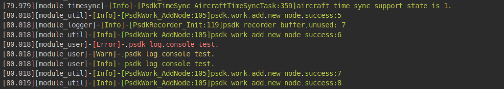

> **NOTE:** This article is **Machine-Translated**. If you have any questions about this article, please send an <a href="mailto:dev@dji.com">E-mail </a>to DJI, we will correct it in time. DJI appreciates your support and attention.

## Overview
The log management of PSDK supports four types of the log: Debug, Info, Warn, and Error by eight methods such as serial port, terminal, or USB. The terminal tools such as Putty could display the colors of the log.    

The structure of the log is as follows: First Identifier（color） + System time + Module Name + Level + Log Content + End Identifier（color）    

#### Identifier
The terminal that doesn‘t support display the color of the log would display the identifier of the color.
* Color: Different types of the log have different colors. The terminal that supports display the color of the log would display different types of logs in different colors.      

* The color of the first identifier：
  * Black: `\033[30m` ; Red: `\033[31m` ; Green:`\033[32m` 
  * Yellow: `\033[33m` ; Blue: `\033[34m` ; Purple:`\033[35m`
  * Cyan:, `\033[36m` ; White:`\033[37m`

* End identifier: `\033[0m`  

#### Content
* Time: When the payload is powered on, the time of the payload is the time of the payload system. After the time synchronization, the time of the payload is synchronized to the drone (ms).
* Module Name: The name of the PSDK module (this name cannot be modified), and the module name of the user print interface is "module_user".
* Content: The content of the log does not exceed 500 bytes.
* Level: Table 1 shows the level of logs from high to low are Debug, Info, Warn, and Error. The log management module can print all logs which lower than the specified.    

<div><div><p>Table 1 The level of logs</p></div><div>
	<table>
	<thead>
	<tr>
		<td>Level</td>
		<td>Interface</td>
		<td>Color</td>
	</tr>
	</thead>
	<tbody>
	<tr>
		<td>Debug - 4</td>
		<td>PsdkLogger_UserLogDebug</td>
		<td>White</td>
	</tr>
	<tr>
		<td>Info - 3</td>
		<td>PsdkLogger_UserLogInfo</td>
		<td>Green</td>
	</tr>
	<tr>
		<td>Warn - 2</td>
		<td>PsdkLogger_UserLogWarn</td>
		<td>Yellow</td>
	</tr>
	<tr>
		<td>Error - 1</td>
		<td>PsdkLogger_UserLogError</td>
		<td>Red</td>
	</tr>
	</tbody>
</table></div></div>


## Develop with the Log Management
Before using the "Log Management" to develop the payload, developer needs to initialize the module of the log management with the following code.

> **NOTE:** This tutorial uses the sample which developed on RTOS using STM32 print the log from the serial port as an example to introduce the method and steps of developing the log management.

#### 1. Initialization
It is recommended to use the serial port to print the log when develop the log management of the payload on the RTOS system, so the first step is to initialize serial port and register log output method with the following code.

```c
static T_PsdkReturnCode PsdkUser_Console(const uint8_t *data, uint16_t dataLen)
{
    UART_Write(PSDK_CONSOLE_UART_NUM, (uint8_t *) data, dataLen);
    return PSDK_RETURN_CODE_OK;
}

UART_Init(PSDK_CONSOLE_UART_NUM, PSDK_CONSOLE_UART_BAUD);
```

#### 2. Register the log print console
Develop the log management of the payload, developer needs to initialize the log printing method and set the level, and register those informations by `PsdkLogger_AddConsole()`.

>**NOTICE：** The log management only supports eight methods to print the log.

```c
T_PsdkLoggerConsole printConsole = {
    .consoleLevel = PSDK_LOGGER_CONSOLE_LOG_LEVEL_INFO,
    .func = PsdkUser_Console,
};

if (PsdkLogger_AddConsole(&printConsole) != PSDK_RETURN_CODE_OK) {
    printf("psdk add console print error");
    return PSDK_RETURN_CODE_ERR_UNKNOWN;
}
```

#### 3. Log Printing
 Figure 1 shows the log printed from the payload.


```
PsdkLogger_UserLogError("psdk log console test.");
PsdkLogger_UserLogWarn("psdk log console test.");
PsdkLogger_UserLogInfo("psdk log console test.");
PsdkLogger_UserLogDebug("psdk log console test.");
```

<div>
<div style="text-align: center"><p>Figure 1 The log of the payload</p>
</div>
<div style="text-align: center"><p><span>
      </span></p>
</div></div>

>**NOTE:** The level of the log is Info, so that the log which level is Info、Warn and Error printed on the terminal, the Debug is not.

## Debug
* Linux:
  * Clion IDE:Use [Grep Console](https://plugins.jetbrains.com/plugin/7125-grep-console/) to filter the log
  * Command:Execute`./demo_linux_ubuntu | grep 'Info'`to filter the log, for details please use `man grep`

* RTOS:SecureCRT、XShell or Putty 

