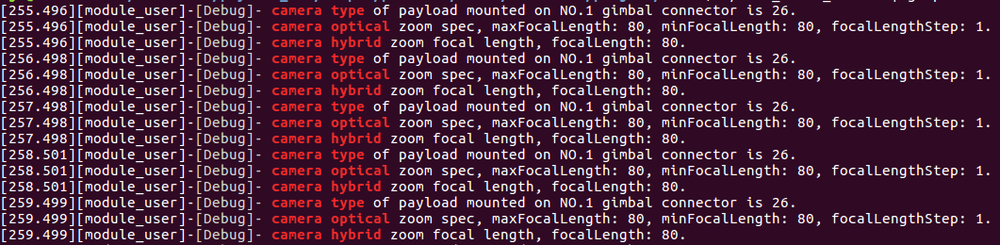

> **NOTE:** This article is **machine-translated**. If you have any questions about this article, please send an <a href="mailto:dev@dji.com">E-mail </a>to DJI, we will correct it in time. DJI appreciates your support and attention.

## Overview
Payload coordination is a mode of controlling multiple payloads to work, searchlights and cameras in coordination could meet the needs of nighttime search; supplementary lights and zoom cameras in coordination could meet the needs of inspection tasks; the visible light camera and the spectrum camera in coordination could meet the needs of the detection task.

>**NOTE:** Using DJI Pilot could control the payload in coordination,for details please refer to the <a href="https://www.dji.com/cn/matrice-200-series-v2/info#downloads" target="_blank" rel="external">User's Manual</a> or DJI Pilot.

## Develop with the Payload Coordination
The payload on the Gambal Ⅱ could obtain the information of the Gimbal I，such as camera type、focal length and zoom data, etc.

>**Notoice** 
> * Please mount the payload which developed based on PSDK on the Gimbal Ⅱ, and the Gimbal I only support mount the specified <a href="#t01">payload</a>.
> * If the payload which developed based on PSDK already has the functions of taking pictures, recording and Gambal control, the payload has the coordination function.
> * This tutorial introduces how to develop the payload coordination (coordinated zoom) by using the camera's type.

#### 1. Initialization
Before using the "Payload Coordination" to develop the payload, developer need to initialize the module of the payload coordination with the following code.

```c
if (PsdkPayloadCollaboration_Init() != PSDK_RETURN_CODE_OK) {
    PsdkLogger_UserLogError("payload collaboration module init error");
    return PSDK_RETURN_CODE_ERR_UNKNOWN;
}
```

#### 2. Obtain the position of the payload
The payload developed based on PSDK must be mounted on the Gimbal I, otherwise the payload coordination couldn't work.

```c
psdkStat = PsdkAircraftInfo_GetBaseInfo(&aircraftBaseInfo);
if (psdkStat != PSDK_RETURN_CODE_OK) {
    PsdkLogger_UserLogError("get aircraft information error: %lld.", psdkStat);
    return psdkStat;
}

if (aircraftBaseInfo.payloadMountPosition == PSDK_AIRCRAFT_INFO_PAYLOAD_MOUNT_POSITION_NO1) {
    PsdkLogger_UserLogError("do not meet conditions of payload collaboration.");
    return PSDK_RETURN_CODE_ERR_SYSTEM;
}
```

#### 3. Obtain information from the Gimbal I
The payload mounted on the Gimbal Ⅱ could obtain the information of the payload which mounted on Gimbal I, as shown in Figure 1.

* Obtain the type of the payload which mounted on the Gimbal I

```c
psdkStat = PsdkPayloadCollaboration_GetCameraTypeOfPayload(PSDK_AIRCRAFT_INFO_PAYLOAD_MOUNT_POSITION_NO1,
                                                           &no1CameraType);

if (psdkStat != PSDK_RETURN_CODE_OK) {
    PsdkLogger_UserLogError("get camera type of payload mounted on NO.1 Gimbal connector error.");
    continue;
}
PsdkLogger_UserLogDebug("camera type of payload mounted on NO.1 Gimbal connector is %d.", no1CameraType);
```
* Obtain the zoom parameter of the payload which mounted on the Gimbal I

```c
psdkStat = PsdkPayloadCollaboration_GetCameraOpticalZoomSpecOfPayload(
    PSDK_AIRCRAFT_INFO_PAYLOAD_MOUNT_POSITION_NO1, &no1CameraOpticalZoomSpec);
if (psdkStat != PSDK_RETURN_CODE_OK) {
    PsdkLogger_UserLogError(
        "get camera optical zoom specification of payload mounted on NO.1 Gimbal connector error.");
    continue;
}
PsdkLogger_UserLogDebug(
    "camera optical zoom spec, maxFocalLength: %d, minFocalLength: %d, focalLengthStep: %d.",
    no1CameraOpticalZoomSpec.maxFocalLength, no1CameraOpticalZoomSpec.minFocalLength,
    no1CameraOpticalZoomSpec.focalLengthStep);
```

* Obtain the focal length of the payload which mounted on the Gimbal I

```c
psdkStat = PsdkPayloadCollaboration_GetCameraHybridZoomFocalLengthOfPayload(
PSDK_AIRCRAFT_INFO_PAYLOAD_MOUNT_POSITION_NO1, &no1CameraHybridZoomFocalLength);
if (psdkStat != PSDK_RETURN_CODE_OK) {
PsdkLogger_UserLogError(
"get camera hybrid zoom focal length of payload mounted on NO.1 Gimbal connector error.");
continue;
}
PsdkLogger_UserLogDebug("camera hybrid zoom focal length, focalLength: %d.", no1CameraHybridZoomFocalLength);
```
<div>
<div style="text-align: center"><p> Figure 1 The parameters of the payload </p>
</div>
<div style="text-align: center"><p><span>
      </span></p>
</div></div>

## Products
<table id="t01">
  <thead>
    <tr>
      <th>Function</th>
      <th>Sync Control</th>
      <th>Sync Zoom</th>
    </tr>
  </thead>
  <tbody>
    <tr>
      <th>Products </th>
      <td>M210 V2、M210 RTK V2</td>
      <td>M210、M210 RTK、M210 V2、M210 RTK V2</td>
    </tr>
    <tr>
      <th>Gimbal I</th>
      <td>ZENMUSE XT、ZENMUSE XT2；</br>ZENMUSE X7、ZENMUSE Z30；</br>ZENMUSE X4S、ZENMUSE X5S</td>
      <td>ZENMUSE XT2、ZENMUSE X4S；</br>ZENMUSE X5S、ZENMUSE X7；</br>ZENMUSE Z30</td>
    </tr>
  </tbody>
</table>
