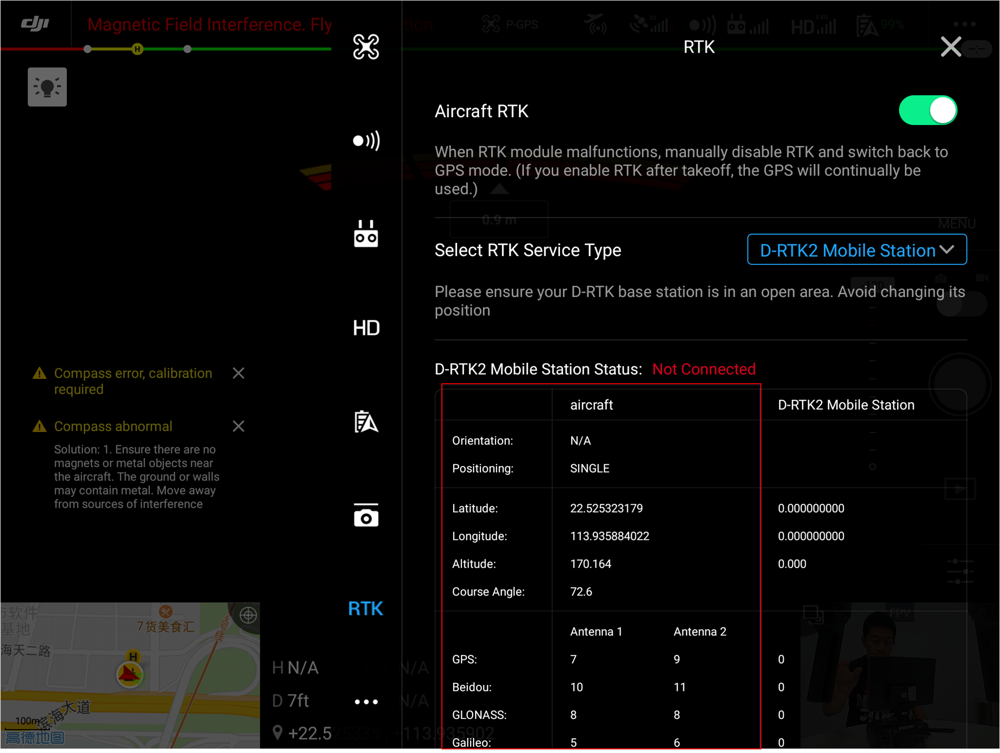

> **NOTE** 
> * This article is **Machine-Translated**. If you have any questions about this article, please send an <a href="mailto:dev@dji.com">E-mail </a>to DJI, we will correct it in time. DJI appreciates your support and attention.
> * Before running the "Positioning" sample code, please check the communication status of the drone and the RTK satellite from the DJI Pilot or Mobile APP which developed based on PSDK as shown in Figure 1. 

<div>
<div style="text-align: center"><p>Figure 1 The status of RTK </p>
</div>
<div style="text-align: center"><p><span>
      </span></p>
</div></div>
 
## Overview
To meet the centimeter-level accuracy positioning requirements of the payload developed based on PSDK, DJI supports developers to use reference stations (such as D-RTK 2) and mobile stations (such as M210 RTK V2) with the help of RTK to obtain the flying attitude and high-precision positioning information of the drone. 

## Concepts  

* Target Point: The position where the positioning information is obtained, such as the center point of the gimbal.
   > **NOTE** The target point of the M210 RTK V2 and M300 RTK is the center point on the upper surface of the adapter ring of the payload. The payload needs to be mounted on the Gimbal I.
* Interest Point: The position of a device on the payload specified by the user arbitrarily, such as the center point of a camera image sensor. The target point can also be a point of interest.
* Task: A set of multiple continuous flight actions is called a task, such as performing a mapping task on a certain area.
* Positioning Event: An event that triggers a positioning request. If a positioning request is triggered when a camera is exposed, "camera exposure" is a positioning event; a collection of multiple events is an event collection. Payload developed based on PSDK can request multiple position information at the same time, such as camera co-exposure.

## Workflow
> **NOTE** Obtaining the precise positioning, the developer needs to use the time synchronization function to synchronize the time of the payload and the drone. For details please refer to [Time Synchronization](../basicfunction/time-synchronization.html)。   

* When a positioning event occurs, the payload would record the local time (this time is on the payload).
* The payload converts the time which on the payload to the time which on the drone, 
* The payload uses the drone time (time of the drone system) to request the location when the positioning event occurs.

> **NOTE** The drone time (time of the drone system) at the time of the positioning event should be earlier than the latest rising edge time of the PPS signal, and the time interval must in 1～2s, as shown in Figure 2. 
 
<div>
<div style="text-align: center"><p>Figure 2 Obtaining the positioning  </p>
</div>
<div style="text-align: center"><p><span>
      </span></p>
</div></div>
 
 After obtaining the position of the target point, use the position of the target point and other parameters, the developer could calculate the target point.

## Develop with the Positioning

### 1. Initialization
Before using the "Positioning" to develop the payload, the developer needs to initialize the module of the positioning with the following code. 

```c
psdkStat = PsdkPositioning_Init();
if (psdkStat != PSDK_RETURN_CODE_OK) {
    PsdkLogger_UserLogError("positioning module init error.");
    return psdkStat;
}
```

##### Set the task number
It is recommended to use the task number to help the user to find the log in the Mark file, if not the task number is 0.

```
PsdkPositioning_SetTaskIndex(0);
```

### 2. Request the information of the payload
After trigger the positioning, the payload will obtain accurate positioning information according to the time of the positioning event.

1. Obtain the time of the payload     
The user triggers the positioning, and the payload could obtain the local time on the payload when the PPS signal is triggered.

```c
psdkStat = PsdkTest_TimeSyncGetNewestPpsTriggerLocalTimeUs(&ppsNewestTriggerTimeUs);
if (psdkStat != PSDK_RETURN_CODE_OK) {
    PsdkLogger_UserLogError("get newest pps trigger time error: %lld.", psdkStat);
    continue;
}
```

2. Time conversion     
converts the time on the payload to the time of the drone system when the positioning event occurs.

```c
for (i = 0; i < TEST_EVENT_COUNT; ++i) {
    eventInfo[i].eventSetIndex = s_eventIndex;
    eventInfo[i].targetPointIndex = i;

    psdkStat = PsdkTimeSync_TransferToAircraftTime(
        ppsNewestTriggerTimeUs - i * TEST_TIME_INTERVAL_AMONG_EVENTS_US, &aircraftTime);
    if (psdkStat != PSDK_RETURN_CODE_OK) {
        PsdkLogger_UserLogError("transfer to aircraft time error: %lld.", psdkStat);
        continue;
    }

    eventInfo[i].eventTime = aircraftTime;
}
```

3. Obtain the positioning information      
 After time synchronization, the developer could obtain the precise position, the detailed position information of the payload as shown in Figure 3.

```c
psdkStat = PsdkPositioning_GetPositionInformationSync(TEST_EVENT_COUNT, eventInfo, positionInfo);
if (psdkStat != PSDK_RETURN_CODE_OK) {
    PsdkLogger_UserLogError("get position information error.");
    continue;
}

PsdkLogger_UserLogDebug("request position of target points success.");
PsdkLogger_UserLogDebug("detail position information:");
for (i = 0; i < TEST_EVENT_COUNT; ++i) {
    PsdkLogger_UserLogDebug("position solution property: %d.", positionInfo[i].positionSolutionProperty);
    PsdkLogger_UserLogDebug("pitchAttitudeAngle: %d\trollAttitudeAngle: %d\tyawAttitudeAngle: %d",
                            positionInfo[i].uavAttitude.pitch, positionInfo[i].uavAttitude.roll,
                            positionInfo[i].uavAttitude.yaw);
    PsdkLogger_UserLogDebug("northPositionOffset: %d\tearthPositionOffset: %d\tdownPositionOffset: %d",
                            positionInfo[i].offsetBetweenMainAntennaAndTargetPoint.x,
                            positionInfo[i].offsetBetweenMainAntennaAndTargetPoint.y,
                            positionInfo[i].offsetBetweenMainAntennaAndTargetPoint.z);
    PsdkLogger_UserLogDebug("longitude: %f\tlatitude: %f\theight: %f",
                            positionInfo[i].targetPointPosition.longitude,
                            positionInfo[i].targetPointPosition.latitude,
                            positionInfo[i].targetPointPosition.height);
    PsdkLogger_UserLogDebug("longStandardDeviation: %f\tlatStandardDeviation: %f\thgtStandardDeviation: %f",
                            positionInfo[i].targetPointPositionStandardDeviation.longitude,
                            positionInfo[i].targetPointPositionStandardDeviation.latitude,
                            positionInfo[i].targetPointPositionStandardDeviation.height);
}

s_eventIndex++;
```
<div>
<div style="text-align: center"><p>Figure 3 Positioning details </p>
</div>
<div style="text-align: center"><p><span>
      </span></p>
</div></div>

### Query
Query the positioning information in `cam_mark_file`.For details of the Mark file, please refer to the [Mark file](https://djisdksupport.zendesk.com/hc/en-us/articles/360024019493-Introduction-to-Mark-File).

> **NOTE** M300 RTK don't support query the positioning informationo in Mark file。

## Products
* M210 RTK V2
* M300 RTK
