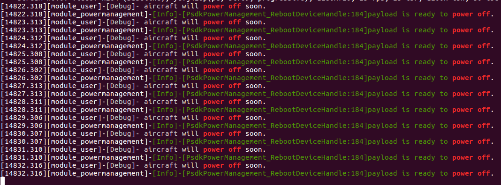

> **NOTE:** This article is **machine-translated**. If you have any questions about this article, please send an <a href="mailto:dev@dji.com">E-mail </a>to DJI, we will correct it in time. DJI appreciates your support and attention.

## Overview
After the payload which developed based on PSDK mounted on the drone, the payload could apply the higher power from the drone, therefore, the payload with the high power must also support the low power. The PSDK also provides the power off notification for the payload to avoid damage or lose the data.

## Develop with the Power Management
### 1. Initialization  
Before apply for the high power, the developer needs to initialize the pins to apply the high power.

```c
static T_PsdkReturnCode PsdkTest_HighPowerApplyPinInit(void)
{
    GPIO_InitTypeDef GPIO_InitStructure;

    RCC_AHB1PeriphClockCmd(HIGH_POWER_APPLY_RCC, ENABLE);

    GPIO_InitStructure.GPIO_Mode = GPIO_Mode_OUT;
    GPIO_InitStructure.GPIO_PuPd = GPIO_PuPd_DOWN;
    GPIO_InitStructure.GPIO_Speed = GPIO_Speed_100MHz;

    GPIO_InitStructure.GPIO_Pin = HIGH_POWER_APPLY_PIN;
    GPIO_Init(HIGH_POWER_APPLY_Port, &GPIO_InitStructure);

    return PSDK_RETURN_CODE_OK;
}
```
> **NOTE：** Please refer to the library of the development platform to init the pins to apply for the high power。

### 2. Develop and register functions to change the state of the payload pins
1.Develop and register the function to change the status of the payload pins     
After developing the function that changes the payload pins status, the developer must register this function in the specified interface.    

```c
static T_PsdkReturnCode PsdkTest_WriteHighPowerApplyPin(E_PsdkPowerManagementPinState pinState)
{
    BitAction action;
    switch (pinState) {
        case PSDK_POWER_MANAGEMENT_PIN_STATE_RESET:
            action = Bit_RESET;
            break;
        case PSDK_POWER_MANAGEMENT_PIN_STATE_SET:
            action = Bit_SET;
            break;
        default:
            PsdkLogger_UserLogError("pin state unknown: %d.", pinState);
            return PSDK_RETURN_CODE_ERR_UNKNOWN;
    }
    GPIO_WriteBit(HIGH_POWER_APPLY_Port, HIGH_POWER_APPLY_PIN, action);
    return PSDK_RETURN_CODE_OK;
}
```

2.Register the callback function      
Use the High Power Apply function of the PSDK, the developer must register the function to the specified interface.

```c
psdkStat = PsdkPowerManagement_RegWriteHighPowerApplyPinCallback(s_applyHighPowerHandler.pinWrite);
if (psdkStat != PSDK_RETURN_CODE_OK) {
    PsdkLogger_UserLogError("register WriteHighPowerApplyPinCallback error.");
    return psdkStat;
}
```

### 3.High Power Apply
The payload calls the interface `PsdkPowerManagement_ApplyHighPowerSync()` to apply the high power from the drone. After that use the voltmeters could measure the voltage of the output interfaces which on the Skyport V2 and X-Port.

```c
psdkStat = PsdkPowerManagement_ApplyHighPowerSync();
if (psdkStat != PSDK_RETURN_CODE_OK) {
    PsdkLogger_UserLogError("apply high power error");
    return psdkStat;
}
```

## Develop with the Poweroff Notification

The process of the Poweroff Notification is as follow:
* When the drone obtains the power off command sent by the user, the drone will send a power-off notification to the payload which developed based on PSDK, and waiting for the feedback.
* When the payload receives the power-off notification sent by the drone, the payload will complete the operations such as storing the information, and change the preparation status.
* When the drone gets all the feedback from the payload and other components, the drone will shut down.

>**NOTE:** After receiving the power-off command for a period of time, the drone will be forced to shut down. The forced shutdown time for different models please refer to the <a href="https://www.dji.com/cn/products/enterprise?site=brandsite&from=nav#drones">User's Manual</a>.

#### 1.Develop and register the functions of power off  
After develope the function to power off the payload, the developer must register this function in the specified interface.    

```c
static T_PsdkReturnCode PsdkTest_PowerOffNotificationCallback(bool *powerOffPreparationFlag)
{
    PsdkLogger_UserLogDebug("aircraft will power off soon.");
    *powerOffPreparationFlag = true;
    return PSDK_RETURN_CODE_OK;
}
```

#### 2. Register the callback function        
After register the power off function of the payload, when the payload received the notification to power off, the payload will prepare to power off and change the status, as shown in Figure 1.

```c
psdkStat = PsdkPowerManagement_RegPowerOffNotificationCallback(PsdkTest_PowerOffNotificationCallback);
if (psdkStat != PSDK_RETURN_CODE_OK) {
    PsdkLogger_UserLogError("register power off notification callback function error");
    return psdkStat;
}
```

<div>
<div style="text-align: center"><p>Figure 1 The information of the power off</p>
</div>
<div style="text-align: center"><p><span>
      </span></p>
</div></div>
 