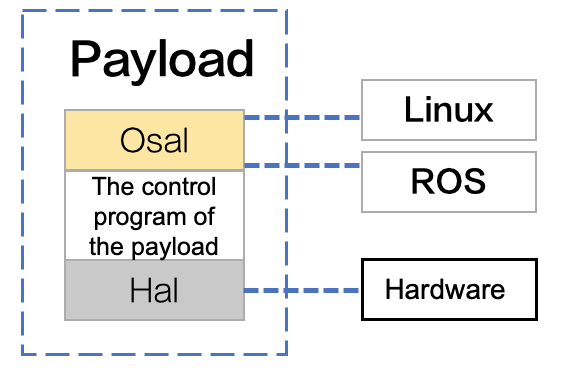

> **NOTE:** This article is **machine-translated**. If you have any questions about this article, please send an <a href="mailto:dev@dji.com">E-mail </a>to DJI, we will correct it in time. DJI appreciates your support and attention.

Transplant the payload control program developed based on PSDK to a different OS and Platforms, developer need to initialize the Hal and Osal layer, and register key configuration information firstly; loading the static library, resource file, and declaring a structure to set the basic information; at last, use the specified interface to register the Platform module in the control program to obtain hardware resources and operating system resources.

>**Sample**
> * Linux ： `sample/maniflod2/Applicaiton/platform`
> * FreeRTOS： `sample/stm32f4_eval/Application/platform`

>**NOTE:** The interface of the PSDK Platform module is in the fellow directory``psdk_lib/api_headers/psdk_platform.h`.

## Overview
Transplant the payload control program developed based on PSDK to a different OS and Platforms, developer need to adapted the Hal (Hardware Abstraction Layer, hardware interface layer), and the Osal (Operating System Abstraction Layer) ), as shown in Figure 1.   
<div>
<div style="text-align: center"><p>Figure 1 Transplant  </p>
</div>
<div style="text-align: center"><p><span>
      </span></p>
</div></div>

### Hal
Hal, Hardware Abstraction Layer is the PSDK hardware interface abstraction layer, which is located between the operating system, payload control program and hardware interface. After registered the hardware information in the `PsdkPlatform_RegHalUartHandlerregisters`, the payload program developed based on PSDK could access the underlying resources of the payload hardware, made the payload control program adapted to different hardware platforms, such as STM32F407IGH6-EVAL or Manifold 2-C.

#### Serial function
After the developer develops the following functions, the payload control program developed based on PSDK could communicate with the different hardware platforms.

* Serial Port Initialization:`T_PsdkReturnCode Hal_UartInit(void)`
* Send Data:`T_PsdkReturnCode Hal_UartSendData(const uint8_t *buf， uint16_t len)`
* Receive Data:`T_PsdkReturnCode Hal_UartReadData(uint8_t *buf， uint16_t *len)`

#### Serial Port Parameters
To communicate with the payload and DJI drone, please rewrite the parameters of the Serial Port.

* Baud Rate: 460800
* Stop Bits: 1
* Data Bits: 8
* Parity: None

### Osal
Osal, Operating System Abstraction Layer is the operating system abstraction layer of PSDK, located between the payload control program and the operating system. After registered the platform information in the `PsdkPlatform_RegOsalHandler`, the payload program developed based on PSDK could access the core of the payload operating system, made the payload control program adapted to different operating systems.

#### Thread
Use the thread mechanism to manage the payload control program, the developer needs to develop functions such as thread create, thread destroy, and sleep.

* Thread Create:

```
 T_PsdkReturnCode (*TaskCreate)(T_PsdkTaskHandle *task,
                                void *(*taskFunc)(void *),
                                uint32_t stackSize,void *arg)
```

* Thread destroy:`T_PsdkReturnCode (*TaskDestroy)(T_PsdkTaskHandle task)`
* Sleep：`T_PsdkReturnCode (*TaskSleepMs)(uint32_t timeMs)`

#### Mutex
Mutex is a mechanism used to prevent multiple threads from reading and writing to common resources (such as shared memory, etc.) on the same queue, counter, and interrupt handler at the same time. Use the mutex mechanism to manage the payload control program，developer needs to develop functions such as the mutex create, mutex destroys, mutex lock, and unlock.

* Mutex Create:`T_PsdkReturnCode (*MutexCreate)(T_PsdkMutexHandle *mutex)`  
* Mutex Destroy:`T_PsdkReturnCode (*MutexDestroy)(T_PsdkMutexHandle mutex)`  
* Mutex Lock:`T_PsdkReturnCode (*MutexLock)(T_PsdkMutexHandle mutex)`        
* Mutex Unlock:`T_PsdkReturnCode (*MutexUnlock)(T_PsdkMutexHandle mutex)`    

#### Semaphore
The semaphore is a mechanism that prevents multiple threads from operating on the same code segment at the same time. Use the semaphore mechanism to manage the payload control program, the developer needs to develop functions such as semaphores creat, semaphores destroy, semaphores wait, semaphores timed wait and semaphores post.

* Semaphores Creat:`T_PsdkReturnCode (*SemaphoreCreate)(T_PsdkSemHandle *semaphore， uint32_t initValue)`
  >**NOTE:** Please initial value of the semaphore by `initValuethe`

* Semaphores Destroy:`T_PsdkReturnCode (*SemaphoreDestroy)(T_PsdkSemHandle semaphore)`
* Semaphores Wait:`T_PsdkReturnCode (*SemaphoreWait)(T_PsdkSemHandle semaphore)`
  >**NOTE:** The maximum waiting time of the waiting semaphore is 32767ms.

* Semaphores TimedWait:`T_PsdkReturnCode (*SemaphoreTimedWait)(T_PsdkSemHandle semaphore，uint32_t waitTimeMs)`
* Semaphores Post:`T_PsdkReturnCode (*SemaphorePost)(T_PsdkSemHandle semaphore)`

#### System Time 
Get the time of the system (ms):`T_PsdkReturnCode (*GetTimeMs)(uint32_t *ms)`

#### Memory Management
* Apply:`void *(*Malloc)(uint32_t size)`
* Release:`void (*Free)(void *ptr)`

## Develop with the Transplant  
### 1. Initialization
After creating the project file, please call the following interface, and register the functions of the hardware platform and operating system to the payload control program which developed based on PSDK, otherwise the payloads couldn't execute on the other hardware platforms and operating systems.

```c
T_PsdkReturnCode PsdkPlatform_RegHalUartHandler(const T_PsdkHalUartHandler *halUartHandler);
T_PsdkReturnCode PsdkPlatform_RegOsalHandler(const T_PsdkOsalHandler *osalHandler);
```

#### Adaptation the Hal
Rewrite the serial configuration parameters in the `hal_uart.c`.

* Linux   
uses the USB-to-serial port module to connect a third-party development platform to DJI drone, the default identification of the third-party development platform is `ttyUSB0`, only develope and register the functions such as serial device initialization、data receive and data send, the user could use the serial port to communicate with the drone.    
For details, please refer to:`/sample/platform/linux/manifold2/hal/hal_uart.c`

* RTOS
According to the MCU model developer needs to configure the serial ports, only develope and register the functions such as serial device initialization、data receive and data send, the user could use the serial port to communicate with the drone.    
For details, please refer to:`sample/platform/rtos_freertos/stm32f4_eval/hal/hal_uart.c`

#### Adaptation the Osal

* Linux    
Standard library: `pthread` has packaged the thread, mutexes, semaphores of ` T_PsdkOsalHandler`.    
For details, please refer to:`sample/maniflod2/Applicaiton/platform/osal.c`

* RTOS   
Use the `thread` packaged by CMSIS, to package the thread, mutexes, semaphores of`T_PsdkOsalHandler`.  
For details, please refer to: `/sample/platform/rtos_freertos/common/osal/osal.c`

### 2. Config the basic information

#### Load files
* Load library:`psdklib.a` and `CMakeLists.txt`
* Quot the Head file:

```c
#include "psdk_platform.h"
#include "platform/osal.h"
#include "platform/hal_uart.h"
```

#### Declaration
Fill the content in `T_PsdkOsalHandler` and `T_PsdkOsalHandler`

* T_PsdkHalUartHandler halUartHandler

```c
T_PsdkHalUartHandler halUartHandler = {
    .UartInit = Hal_UartInit,
    .UartReadData = Hal_UartReadData,
    .UartWriteData = Hal_UartSendData,
};
```

* T_PsdkHalUartHandler osalHandler

```c
T_PsdkOsalHandler osalHandler = {
    .Malloc = Osal_Malloc,
    .Free = Osal_Free,
    .TaskCreate = Osal_TaskCreate,
    .TaskDestroy = Osal_TaskDestroy,
    .TaskSleepMs = Osal_TaskSleepMs,
    .MutexCreate = Osal_MutexCreate,
    .MutexDestroy = Osal_MutexDestroy,
    .MutexLock = Osal_MutexLock,
    .MutexUnlock = Osal_MutexUnlock,
    .SemaphoreCreate = Osal_SemaphoreCreate,
    .SemaphoreDestroy = Osal_SemaphoreDestroy,
    .SemaphoreWait = Osal_SemaphoreWait,
    .SemaphorePost = Osal_SemaphorePost,
    .SemaphoreTimedWait = Osal_SemaphoreTimedWait,
    .GetTimeMs = Osal_GetTimeMs,
};
```

### 3. Register the transplant module
Call the interface `PsdkPlatform_RegHalUartHandler `and `PsdkPlatform_RegOsalHandler` to register the 
Hal and Osal. 

> **NOTE:** The Platform module must be registered before other PSDK function modules. If the Platform module registrated fail or not, users couldn't use the payload, which developed based on PSDK.

```
if (PsdkPlatform_RegHalUartHandler(&halUartHandler) != PSDK_RETURN_CODE_OK) {
    printf("psdk register hal uart handler error");x`
    return PSDK_RETURN_CODE_ERR_UNKNOWN;
}

if (PsdkPlatform_RegOsalHandler(&osalHandler) != PSDK_RETURN_CODE_OK) {
    printf("psdk register osal handler error");
    return PSDK_RETURN_CODE_ERR_UNKNOWN;
}
```

If there has a feedback `PSDK_RETURN_CODE_OK`, it means that the registration of the Platform module is completed, otherwise please resolve the problem with the error code.