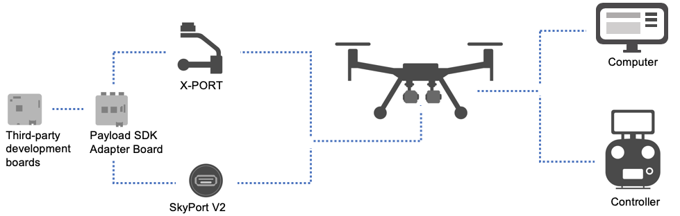
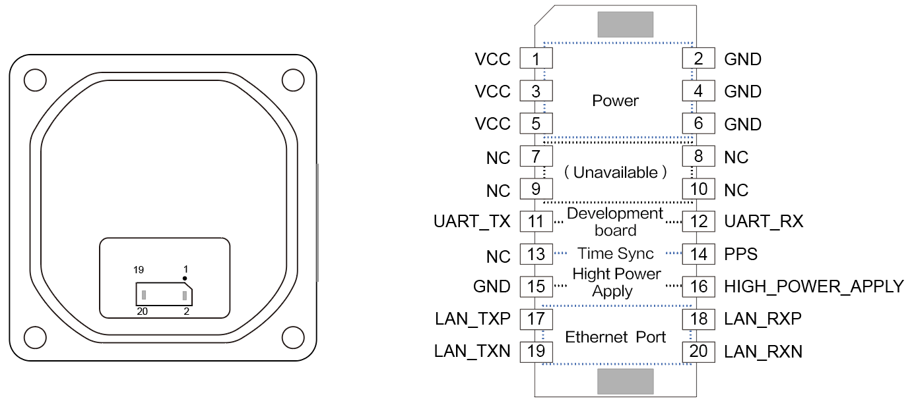
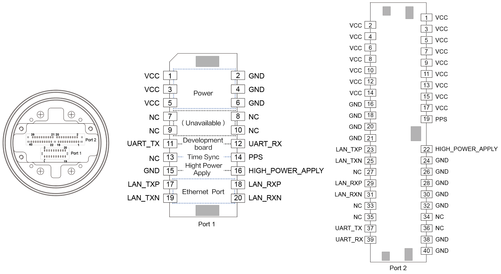
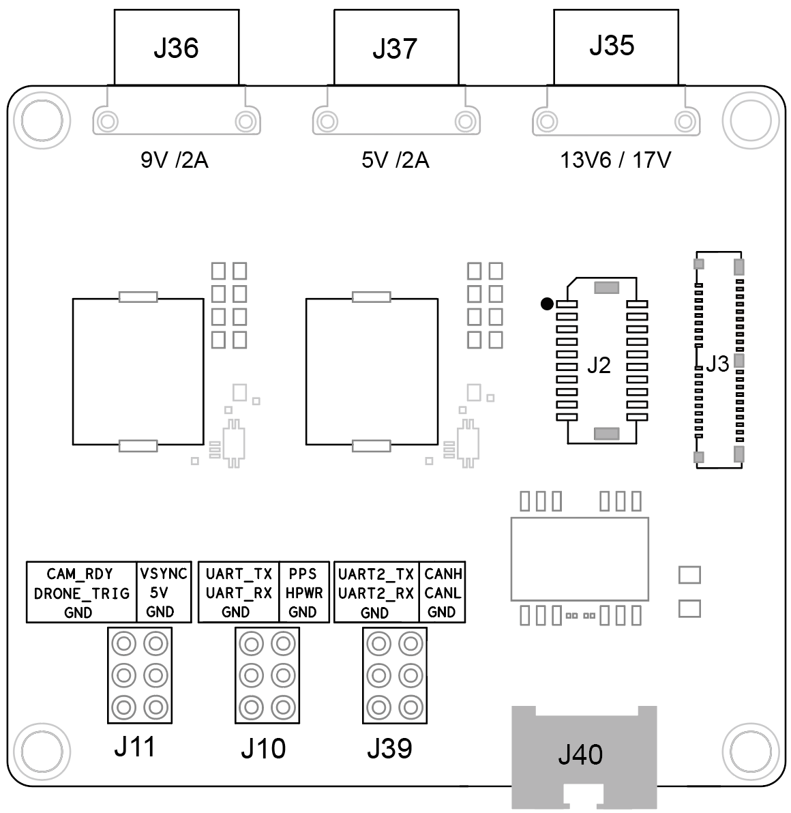

> **NOTE:** This article is **machine-translated**. If you have any questions about this article, please send an <a href="mailto:dev@dji.com">E-mail </a>to DJI, we will correct it in time. DJI appreciates your support and attention.

Figure 1 display the process of connection, that connected Hardware Platform、Payload Development Board、Expansion board and DJI drone.
> **NOTE:** Some hardware interfaces that **were not described in this document** are temporarily unavailable.

Figure 1 Device Connection

      

> **TIP：** Using [User's Manual](https://www.dji.com/en/downloads) to know how to connect the drone and remote controller.

## NOTICE
* The details of the Hardware Platform, please refer to [Hardware Platform](../guide/hardware.html).
* If you still use **PSDK V1.xx** and **Skyport** to develop payload, please find the "PSDK 1.0.0" document on the package.

## Use X-Port
#### X-Port Pin 
Figure 2 shows the pin of X-Port. Use the cable to connect the X-Port to an expansion board or a third-party development board.

Figure 2 X-Port Pin

      

Table 1 X-Port Pin

<table id="interface parameters">
  <thead>
    <tr>
      <th>Pin Number</th>
      <th>Fnuction</th>
    </tr>
  </thead>
  <tbody>
   <tr>
      <td>1～６</td>
      <td>Power Supply </td>
    </tr> 
    <tr>
      <td>11、12 </td>
      <td>Payload communicate with drone（Must）</td>
    </tr>  
    <tr>
      <td>14</td>
      <td>Time Sync(the drone must have RTK)</td>
    </tr>
    <tr>
      <td>15,16 </td>
      <td>High Power Apply</td>
    </tr>
    <tr>
      <td>17～20</td>
      <td>Transfer the high-speed data.</td>
    </tr>
  </tbody>
</table>

#### Install The Payload
1. Install the spindle arm: Use four M2 × 12 screws to lock the payload, and the depth of the corresponding threaded hole on the payload is not less than 5.3 mm.
2. Install the auxiliary shaft arm: Use an M3 screw, auxiliary shaft sleeve, and auxiliary shaft rubber plug to lock the auxiliary shaft arm. Make sure the M3 screw passes through the center axis of the pitch axis.
3. The centroid of the payload
    * For a payload with a constant centroid, the payload must on the vertical line of the pitch axis;
    * For a zoom camera with a variable center of the centroid, the payload must on the vertical line of the pitch axis when the lens is at the maximum magnification.

## Use Skyport V2
Figure 3 shows the pin of Skyport V2. Use the cable to connect the Skyport V2 to an expansion board or a third-party development board on the Port1; use coaxial cable to connect Skyport V2 to payload development board on the Port2.

> **NOTE:** Developer only could choose Port1 or Port2, both of them cannot be used at the same time.

Figure 3 Skyport V2 pin

      

##### Port1 

Table 2 Skyport V2 Pin

<table id="interface parameters">
  <thead>
    <tr>
      <th>Pin Number</th>
      <th>Fnuction</th>
    </tr>
  </thead>
  <tbody>
   <tr>
      <td>1～６</td>
      <td>Power Supply </td>
    </tr> 
    <tr>
      <td>11、12 </td>
      <td>Payload communicate with drone（Must）</td>
    </tr>  
    <tr>
      <td>14</td>
      <td>Time Sync(the drone must have RTK)</td>
    </tr>
    <tr>
      <td>15,16 </td>
      <td>High Power Apply</td>
    </tr>
    <tr>
      <td>17～20</td>
      <td>Transfer the high-speed data.</td>
    </tr>
  </tbody>
</table>

##### Port2 

Table 3 Skyport V2 Pin

<table id="interface parameters">
  <thead>
    <tr>
      <th>Pin Number</th>
      <th>Fnuction</th>
    </tr>
  </thead>
  <tbody>
   <tr>
      <td>1～17</td>
      <td>Power Supply </td>
    </tr> 
    <tr>
      <td>37、39 </td>
      <td>Payload communicate with drone（Must）</td>
    </tr>  
    <tr>
      <td>19</td>
      <td>Time Sync(the drone must have RTK)</td>
    </tr>
    <tr>
      <td>22</td>
      <td>High Power Apply</td>
    </tr>
    <tr>
      <td>23、25、29、31</td>
      <td>Transfer the high-speed data.</td>
    </tr>
  </tbody>
</table>

## Use Expansion Board
Figure 4 shows the port of the expansion board. Use this board, developers could connect the third-party development board and a variety of payloads.

   

      

Figure 4 The port of expansion board

      

      

      

      

    

Table 4 The port of expansion board

<table id="interface parameters">
  <thead>
    <tr>
      <th>Number</th>
      <th>Type</th>
      <th>Name </th>
      <th>Description</th>
    </tr>
  </thead>
  <tbody>
   <tr>
      <td>J2</td>
      <td>Cable interface</td>
      <td rowspan=2>-</td>
      <td>Connect the expansion board with Skyport V2 or X-Port.</td>
    </tr> 
    <tr>
      <td>J3</td>
      <td>Coaxial interface</td>
      <td>Connect the expansion board with Skyport V2 or  payload development board. </td>
    </tr>  
    <tr>
      <td rowspan=3 >J10</td>
      <td rowspan=3>pin</td>
      <td>UART_TX；UART_RX</td>
      <td>Connect the expansion board with the third-party development board.</td>
    </tr>
    <tr>
      <td>PPS(Time Sync)</td>
      <td>Connect to the expansion board with the third-party development boardTime Sync(the drone must have RTK) </td>
    </tr>
    <tr>
      <td>HPWR</td>
      <td>High Power Apply</td>
    </tr>
    <tr>
      <td>J35</td>
      <td rowspan=3>Output</td>
      <td rowspan=3>-</td>
      <td>13.6V/4A or 17V/4A </td>
    </tr>
    <tr>
      <td>J36</td>
      <td>9V/2A</td>
    </tr>
    <tr>
      <td>J37</td>
      <td>5V/2A</td>
    </tr>
    <tr>
      <td>J40</td>
      <td>Network Port</td>
      <td>-</td>
      <td>Get the video stream and user-defined data information.</td>
    </tr>
  </tbody>
</table>

## Connect Development Board
#### Connect to the RTOS development board
Connect the STM32F407xG to the expansion board the configuration of the serial port is as follows:

> **NOTE:** If you need to use other development boards, please rewrite the configuration parameters in the Hal file, for details, please refer to [Porting](../tutorial/Porting.html)。

* Communicate with X-Port or Skyport V2: `PA2 (TX)` and `PA3 (RX)`
* Communicate with computer: `PC10 (TX)` and `PC11 (RX)`
* Time Synchronization: `PD2`
* High Power Apply: `PD1`
* Baud rate: 921600

#### Connect to Linux development board
Connect the Manifold 2-C to the expansion board:

* Use USB to Serial-port module: Connect the USB to serial port module to the `UART_TX` and` UART_RX` pins of the expansion board.
* Use a network cable: Connect the third-party development boards and expansion boards.
