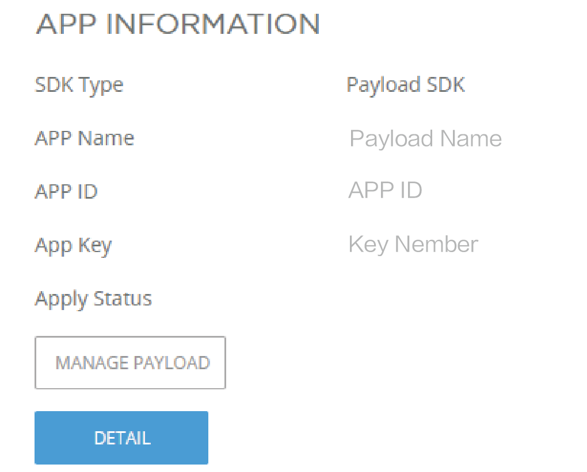

> **NOTE:** This article is **machine-translated**. If you have any questions about this article, please send an <a href="mailto:dev@dji.com">E-mail </a>to DJI, we will correct it in time. DJI appreciates your support and attention.

After registering the account, please download the sample code and supplement the application information, after compiling, debugging, and burning and binding the DJI Hardware Platform to the drone on the DJI Assistant 2, you can run the program, With the help of those samples, you would know how to develop a payload.

> **NOTE:**  If you need to develope the program on the other systems or development board, please refer to [Porting](../tutorial/Porting.html).  

## Download the Sample
After <a href="https://developer.dji.com/payload-sdk/apply/" target="_blank"> registered </a> as a DJI PSDK enterprise user, you can download the DJI PSDK and find the sample code in the package . With the help of sample code, you can learn how to use PSDK and developed the payload quickly.       

## Create the Payload
Figure 1 shows how to add the user's information. First of all, you should obtain the [permissions](https://developer.dji.com/payload-sdk/apply) and create the application on the [User Center](https://developer.dji.com/user/apps/#all).

<div>
<div style="text-align: center"><p>Figure 1 Add the user’s information</p>
</div>
<div style="text-align: center"><p><span>
      </span></p>
</div></div>

## Run the sample on the RTOS
#### Add the user’s information
 
>**NOTE:** The payload development board is **STM32F407IGH6-EVAL**.

* Use Keil IDE open the project `psdk_demo.uvprojx` which in the `sample/stm32f4_eval/Projects/mdk_release/` 

* Add the information in the file : `sample/stm32f4_eval/Application/app_info.h`       
```c
#define USER_APP_NAME               "your_app_name"
#define USER_APP_ID                 "your_app_id"
#define USER_APP_KEY                "your_app_key"
#define USER_DEVELOPER_ACCOUNT      "your_developer_account"
```

#### Compile and Burn

* Software: Keil MDK
* Baud Rate: `921600`
> **NOET：** After compiling the sample code, please burn the compiled program to the payload(such as STM32F407IGH6-EVAL).


## Run the sample on the Linux
#### Add the user’s information
>**NOTE:** The payload development board is **Manifold 2-C**.

* Add the information in the file : `sample/manifold2/Application/app_info.h` 

```
#define USER_APP_NAME               "your_app_name"
#define USER_APP_ID                 "your_app_id"
#define USER_APP_KEY                "your_app_key"
#define USER_DEVELOPER_ACCOUNT      "your_developer_account"
```

* Add the serial-port's name: `sample/manifold2/Application/platform/hal_uart.c`

```c
#define LINUX_UART_DEV   "dev/your_com"
```

#### Compile and Burn

* Use the command to gain the access permission:`sudo chmod 777 /dev/your serial-port's name`

* Compile the project: `sample/manifold2/project/`
the command of compile is as follows:   
  1. `mkdir build`
  2. `cd build`
	3. `cmake -DCMAKE_BUILD_TYPE=Release ..`
	4. `make`

* Execute the sample       
  * Project directory: `sample/manifold2/project/build`
  * Execute command `./demo_linux_ubuntu`  

## Binding
Use DJI Assistant 2 to bind the payload to the DJI drone, after that the payload will run the sample.

> **NOTE:** Please turn on the Data Authorization in the DJI Assistant 2 before debugging the payload.

1. Mount the payload or development board(such as STM32F407IGH6-EVAL) on the drone and connect the drone to computer.
2. Use your account to login the DJI Assistant 2 ，click the “Payload SDK ”tab,enter the PSDK Hardware Platform interface.
3. Click the "Binding" button to bind the Hardware Platform、sample programs and DJI drones.
4. The status of PSDK Hardware Platform is `Bound`.
5. The payload will run the sample program automatically.

### Troubleshooting
#### Skyport Troubleshooting
<table id="3">
  <thead>
    <tr>
      <th>Error Code</th>
      <th>Description</th>
      <th>Solution</th>
    </tr>
  </thead>
  <tbody>
    <tr>
      <td>1</td>
      <td>Unable to get the information of the payload.</td>
      <td>1. Confirm that the hardware platform is properly connected. </br> 2. Confirm that the payload control program developed based on PSDK runs normally. </td>      
    </tr>
    <tr>
      <td>2</td>
      <td>Account illegal. </td>
      <td>Please confirm that the user information in the application is the same which login the DJI Assistant 2.</td>
    </tr>
    <tr>
      <td>3</td>
      <td>Unable to obtain the authentication information.</td>
      <td rowspan=5>Please submit the log of the payload to DJI.</td>  
    </tr>
    <tr>
      <td>4</td>
      <td>Skyport verification failed.</td>
    </tr>
    <tr>   
      <td>5</td>
      <td>Authentication information incorrect. </td>
    </tr>
       <tr>   
      <td>6</td>
      <td>Binding information stored failed.</td>
    </tr>
       <tr>   
      <td>7</td>
      <td>Unable to get the SN.</td>
    </tr>
    </tbody>
</table>

#### Services Troubleshooting
<table id="3">
  <thead>
    <tr>
      <th>Error Code</th>
      <th>Description</th>
      <th>Solution</th>
    </tr>
  </thead>
  <tbody>
    <tr>
      <td>400</td>
      <td>Get the SN failed.</td>
      <td rowspan=5>Please submit the log of the payload to DJI.</td>         
    </tr>
    <tr>
       <td> 500 </td>
       <td> Server exception.</td>
     </tr>
     <tr>
       <td> 700 </td>
       <td> The payload's applications is no found.</td>
     </tr>
     <tr>
       <td> 701 </td>
       <td> Verification failed. </td>
     </tr>
     <tr>
       <td> 702 </td>
       <td> Binding error. </td>
     </tr>
        <tr>
       <td> 703 </td>
       <td> The number of bindings exceeds the limit. </td>
       <td> In development mode, each user can bind up to 10 payload control programs. </td>
     </tr>
     </tbody>
</table>

#### DJI Assistant 2 Troubleshooting
<table id="3">
  <thead>
    <tr>
      <th>Error Code</th>
      <th>Description</th>
      <th>Solution</th>
    </tr>
  </thead>
  <tbody>
    <tr>
      <td>3</td>
      <td>The network is abnormal.</td>
      <td>Please make sure your computer can access the Internet. </td>   
    </tr>
    <tr>
      <td>4</td>
      <td>Softwareb Error</td>
      <td rowspan=2>Reinstall the Assistant2 or restart your computer.</td>   
    </tr>
    <tr>
      <td>5</td>
      <td>FTP Error.</td>
    </tr>
    </tbody>
</table>